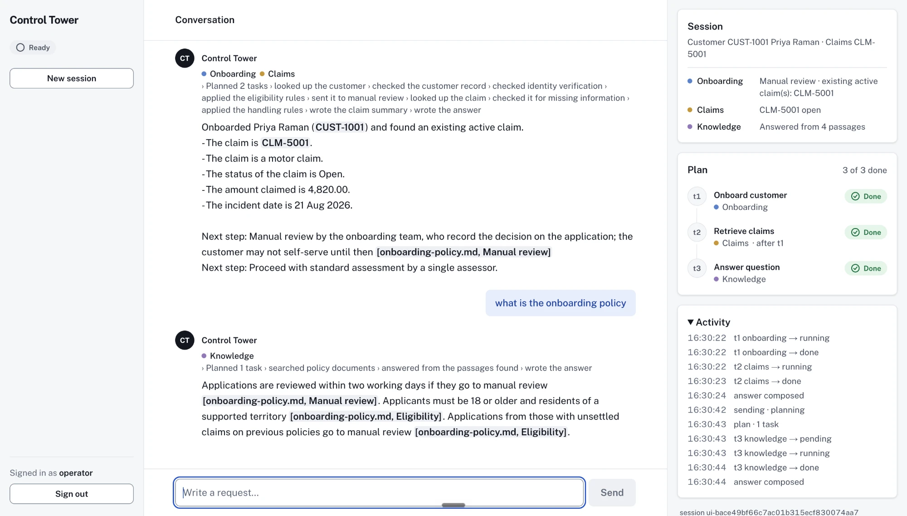
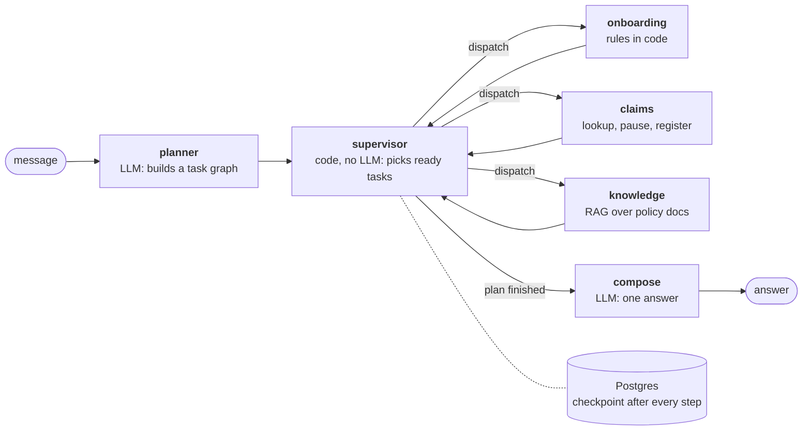
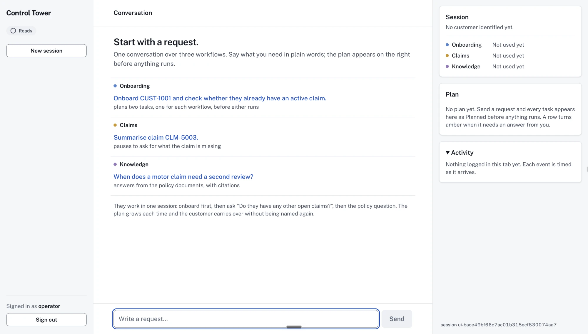
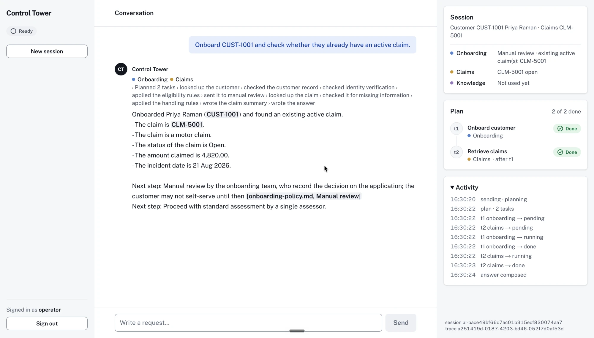
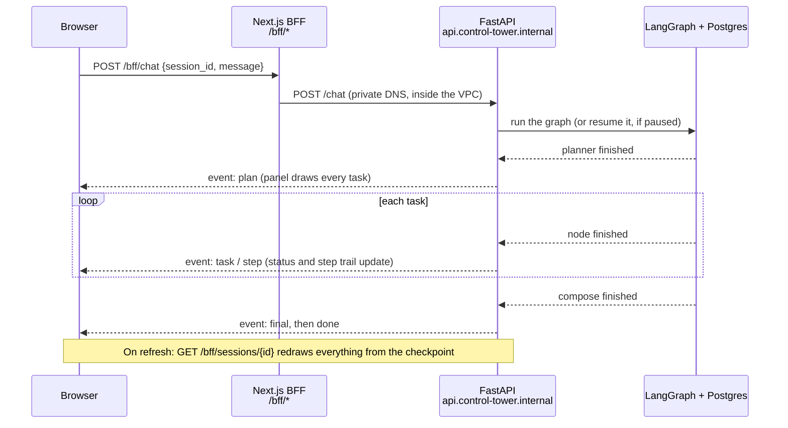
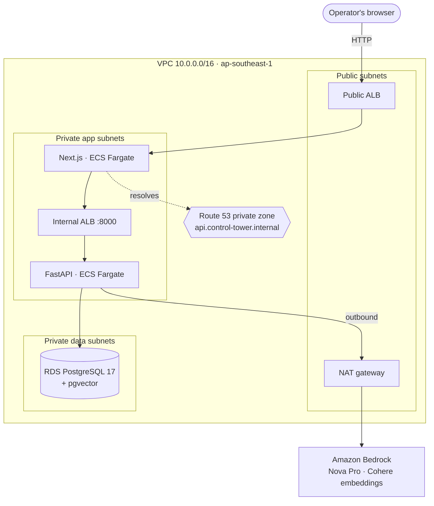

# AI Operations Control Tower

One conversational interface for insurance operations staff. It **plans** a
request into tasks, **coordinates** three business workflows (onboarding,
claims, policy knowledge), **keeps context** when the conversation moves between
them, and **resumes after the process running it dies**.

LangGraph · FastAPI · Next.js · PostgreSQL + pgvector · AWS ECS Fargate ·
Terraform · GitHub Actions



<sub>Every screenshot in this README was captured on the deployed AWS stack, not on localhost.</sub>

**Contents:** [1. Overview](#1-overview) ·
[2. How the LangGraph orchestration works](#2-how-the-langgraph-orchestration-works) ·
[3. How the frontend works](#3-how-the-frontend-works) ·
[4. Infrastructure](#4-infrastructure) ·
[5. The actual deployment](#5-the-actual-deployment) ·
[Getting started →](docs/GETTING_STARTED.md)

---

## 1. Overview

### What it does, in three prompts

| # | The operator types | What it shows |
|---|---|---|
| 1 | *"Onboard CUST-1001 and check whether they already have an active claim."* | **Planning before execution.** A two-task plan (claims waits for onboarding) appears before either task runs. |
| 2 | *"Do they have any other open claims?"*, then a policy question | **Context across workflows.** "They" is resolved from shared state. The same plan grows to three workflows. |
| 3 | *"Onboard CUST-1002"* → kill the backend → restart → answer the question | **Durable execution.** The paused workflow resumes exactly where it stopped. |

The full script with talking points is in [`docs/demo.md`](docs/demo.md).

### Requirements → where they are met

| Requirement | How it is met | Section |
|---|---|---|
| One interface, many workflows | Planner → supervisor → three workflow subgraphs → compose | [2](#2-how-the-langgraph-orchestration-works) |
| Context across workflow switches | The plan is extended, never replaced. Each workflow keeps its own state. The customer in focus is shared. | [2](#2-how-the-langgraph-orchestration-works) |
| Visible task progress | SSE events drive a live plan, a step trail and an activity log | [3](#3-how-the-frontend-works) |
| Resume after restarts | Every step is checkpointed to Postgres. `interrupt()` pauses for the operator. | [2](#2-how-the-langgraph-orchestration-works), [5](#5-the-actual-deployment) |
| AWS infrastructure as code | Terraform: 8 modules + a `dev` environment on ECS Fargate | [4](#4-infrastructure) |
| CI/CD | 5 GitHub Actions workflows. OIDC, no long-lived AWS keys. | [4](#4-infrastructure) |
| **Additional Challenge:** private frontend → backend communication over a domain name | Next.js BFF proxy → Route 53 private zone → internal ALB | [4](#4-infrastructure) |

### Evidence

- **119 backend tests** (91 run without a database) and `ruff` clean.
- **`make verify-resume`** pauses a graph, exits the process, and finishes the
  run from a brand-new process.
- **Deployed to AWS on 2026-09-23** and verified in a browser, including
  stopping the only backend task in the middle of a workflow
  ([section 5](#5-the-actual-deployment)).

How to run it locally, known limitations, repo layout and the docs index are in
**[`docs/GETTING_STARTED.md`](docs/GETTING_STARTED.md)**.

---

## 2. How the LangGraph orchestration works



### One turn, step by step

1. **The planner (LLM)** turns the message into a task graph, for example
   `t2 claims` depends on `t1 onboarding`. It *extends* the existing plan rather
   than replacing it, which is how context survives a change of workflow.
2. **The supervisor (no LLM)** picks the tasks whose dependencies are done and
   dispatches them. When nothing is left, it hands off to compose.
3. **A workflow subgraph** does the work. It can pause with `interrupt()` to ask
   the operator for missing information, such as documents or a police
   reference.
4. **Compose (LLM)** writes one answer for the turn. Citations are built from
   the retrieved chunks, never parsed from the model's output, so a fabricated
   citation cannot reach the operator.

### What makes it durable

- **All state lives in one typed shape,**
  [`ControlTowerState`](backend/app/graph/state.py): messages, the plan, each
  workflow's own state, and the customer in focus.
- **LangGraph checkpoints that state to Postgres after every step.** The
  session id *is* the checkpoint thread id. Any process that has it can
  continue the session.
- **A paused workflow survives a crash.** When the operator answers, the answer
  goes back into the graph as `Command(resume=...)`, and it may land on a
  different process or ECS task.
- **Concurrent task updates merge safely.** The plan uses a custom reducer,
  `merge_tasks`, so parallel tasks writing status at the same time do not
  overwrite each other.

### Where the LLM is used, and where it is not

| Component | LLM? | Why |
|---|---|---|
| Planner | Yes | Reading intent from free text is the ambiguous part |
| Supervisor | **No** | Readiness, failure handling and completion can all be derived from the plan. Making them a model call would add latency and cost, and make routing unpredictable. |
| Onboarding | **No** | Eligibility is a business rule. It belongs in code. |
| Claims | To read free-text replies and write the summary | Code checks that every value the model extracts actually appears in what the operator typed |
| Knowledge | Yes (RAG) | Answering from policy documents is a language task |
| Compose | Yes | Writing the report |

### Decisions

| Decision | Why | Rejected alternative |
|---|---|---|
| Hand-built planner/supervisor graph | The assignment asks to *demonstrate* routing and coordination | `langgraph-supervisor` and `create_agent`, which hide exactly that |
| Postgres for checkpoints, domain data and vectors | One datastore to run and explain | A separate vector DB, a queue, a graph DB |
| One psycopg pool, plain SQL | The checkpointer needs psycopg anyway. A second pool would have no good reason to exist. | SQLAlchemy + Alembic |
| Bedrock Nova Pro in production | Every Anthropic model on this AWS account is blocked by an account-level use-case form. Switching back is one config value. | Waiting on the form |

**Deep dive:** [`langgraph-design.md`](docs/langgraph-design.md) ·
[`state-management.md`](docs/state-management.md) ·
[`tradeoffs.md`](docs/tradeoffs.md)

---

## 3. How the frontend works

### What the operator sees

These screenshots come from the deployed stack
([section 5](#5-the-actual-deployment)): each request below travelled through the
public ALB, the BFF, the private DNS name, and Bedrock.



The workspace has three columns:

- **Left: the session.** Its status (`Ready`, `Live, streaming`,
  `Waiting on you`), a new-session button, and sign-out.
- **Centre: the conversation.** On a new session it offers one example request
  per workflow.
- **Right: what the system is doing.**
  - **Session:** the customer in focus, and what each workflow last did.
  - **Plan:** every task, with its status and dependencies.
  - **Activity:** a timestamped log of every event.



After the first request:

- The **plan** shows `t2 Retrieve claims` running *after t1*.
- The **answer** opens with the workflows used (● Onboarding ● Claims) and a
  trail of the steps actually completed.
- **Next steps** carry their policy citation.
- The **activity log** shows the order: plan → `t1` pending → running → done →
  `t2` running → done → answer composed.

When a workflow pauses, its plan row turns amber and reads **Needs you**, and
the composer changes to **Answer to resume claims** (or onboarding).

### How it talks to the backend



- **The browser only ever calls `/bff/*`,** a relative URL. A Next.js route
  handler forwards the call to the backend over a private DNS name. The browser
  never learns the backend's address, and the backend has no public ingress.
- **Progress streams as Server-Sent Events,** relayed through the BFF. Each
  event drives one part of the UI:

  | Event | UI effect |
  |---|---|
  | `plan` | Draws every task, before any of them runs |
  | `task` | Moves a task between planned, running and done |
  | `step` | Adds a completed step to the answer's trail |
  | `token` | Streams the answer text |
  | `interrupt` | Shows the question, and switches the composer to "Answer to resume" |
  | `final` / `done` | Closes the turn |
  | `error` | Shows what failed |

- **A refresh does not lose anything.** The session id is kept in
  `sessionStorage`. `GET /sessions/{id}` rebuilds the conversation, the plan and
  any waiting question from the checkpoint. This is also how the operator
  continues after a backend crash.
- **Sign-in:** a single operator credential, checked on the Next.js server and
  kept in an HMAC-signed, httpOnly cookie. The same guard protects the pages and
  `/bff/*`.

**Deep dive:** [`frontend/DESIGN.md`](frontend/DESIGN.md) ·
[`frontend/app/bff/[...path]/route.ts`](frontend/app/bff/%5B...path%5D/route.ts)

---

## 4. Infrastructure



### Private networking (the Additional Challenge)

- **The public ALB is the only internet-facing component,** and it only reaches
  the frontend.
- **The frontend reaches the backend by name:**
  `http://api.control-tower.internal:8000`. A Route 53 private zone resolves
  that name, inside the VPC only, to an internal ALB.
- **Every hop is locked to the one before it by security group:** public ALB →
  frontend → internal ALB → backend → RDS. The backend has no public IP and
  only accepts traffic from the internal ALB.

| Decision | Why | Rejected alternative |
|---|---|---|
| Next.js BFF proxy for every API call | Every frontend → backend hop crosses private DNS. No API URL is built into the bundle, so one image works in every environment. | ALB `/api/*` routing, which makes the backend public |
| Internal ALB + Route 53 private zone | The name stays the same when tasks are replaced, which crash recovery depends on. The ALB also health-checks and drains tasks. | Service Connect (its 15s request timeout kills SSE). Cloud Map (resolves to task IPs, which get cached). |

### Terraform

Eight modules and one environment, with state in S3:

| Module | Creates |
|---|---|
| `networking` | VPC, public / app / data subnets across the AZs, one NAT gateway, security groups |
| `alb` | Used twice: the public ALB and the internal ALB |
| `ecs-cluster`, `ecs-service` | The Fargate cluster, and one service each for frontend and backend |
| `rds` | PostgreSQL 17 (`db.t4g.micro`) with pgvector |
| `ecr` | Image repositories |
| `github-oidc` | Three IAM roles for GitHub Actions: plan, apply, deploy |
| `budget` | A $20/month alert |

### CI/CD

```
PR ──▶ CI (tests, lint) + terraform plan (read-only role, no approval needed)
merge to main ──▶ approval gate on the `dev` environment ──▶ build image, tag = commit SHA
      ──▶ push to ECR ──▶ run migrations as a one-off ECS task (exit code checked)
      ──▶ register the task definition by image DIGEST ──▶ roll the ECS service
```

- **No AWS keys are stored in GitHub.** Jobs use OIDC to assume a role. The
  role trusts only jobs running in the `dev` environment, so a human approval
  is required before the credential can exist at all.
- **Deploys use the image digest, not the tag.** A tag can be moved, so rolling
  back to a tag might pull the bad image again. A digest cannot change.
- **Terraform and CI own different things.** Terraform owns the
  infrastructure. CI owns exactly one thing: which image is running. This is
  why Terraform ignores changes to the task definition.
- **Migrations run once, under a lock, before the new code.** They never run at
  app startup, where parallel tasks would race each other.

**Deep dive:** [`networking.md`](docs/networking.md) ·
[`terraform.md`](docs/terraform.md) · [`ecs.md`](docs/ecs.md) ·
[`ci-cd.md`](docs/ci-cd.md)

---

## 5. The actual deployment

The stack was deployed to AWS on **2026-09-23**, in `ap-southeast-1`, and the
full demo was run against the public URL. Everything below links to real
pipeline runs and pull requests. The long-form record is
[`deployment-walkthrough.md`](docs/deployment-walkthrough.md).

- **Live URL:**
  <http://control-tower-dev-public-1783782943.ap-southeast-1.elb.amazonaws.com/>.
  Sign-in is required. The stack is torn down after the demo, so the link may no
  longer resolve.
- The screenshots in [section 3](#3-how-the-frontend-works) were captured here.
- `terraform apply` created **69 resources in about 7 minutes**. RDS was the
  slowest part.
- The backend booted with `provider=bedrock, embeddings=cohere.embed-english-v3`.
- The deployed database was seeded and its corpus embedded by one-off ECS tasks
  on the backend image, because RDS is private.

### Timeline (UTC, 2026-09-23)

| Time | Event | Run / PR |
|---|---|---|
| 02:13 | Bootstrap failed: the S3 bucket name was already taken by another AWS account. Fixed by adding the account ID to the name. The PR plan passed. | [plan](https://github.com/predator-1-ml/ControlTower/actions/runs/35809512438) |
| 02:30 | First merge to `main`. Both images built, migrations ran, both services rolled out. | [#1](https://github.com/predator-1-ml/ControlTower/pull/1) · [backend](https://github.com/predator-1-ml/ControlTower/actions/runs/35810624920) · [frontend](https://github.com/predator-1-ml/ControlTower/actions/runs/35810624877) |
| 02:38 | Fixed faults 1 and 2 below | [#2](https://github.com/predator-1-ml/ControlTower/pull/2) · [terraform](https://github.com/predator-1-ml/ControlTower/actions/runs/35811133122) |
| 02:40 | Fixed fault 3. This was the first `apply` that actually ran through CI. | [#3](https://github.com/predator-1-ml/ControlTower/pull/3) · [terraform](https://github.com/predator-1-ml/ControlTower/actions/runs/35811324193) |
| 03:05 | Fixed fault 4. The frontend became healthy. | [#4](https://github.com/predator-1-ml/ControlTower/pull/4) · [terraform](https://github.com/predator-1-ml/ControlTower/actions/runs/35812980097) · [frontend](https://github.com/predator-1-ml/ControlTower/actions/runs/35813067020) |
| 04:30 | The seed script now ships in the backend image, so the private RDS could be seeded | [#5](https://github.com/predator-1-ml/ControlTower/pull/5) · [backend](https://github.com/predator-1-ml/ControlTower/actions/runs/35818592300) |
| 04:41 | Fixed fault 5. The end-to-end browser run was done after this. | [#6](https://github.com/predator-1-ml/ControlTower/pull/6) · [frontend](https://github.com/predator-1-ml/ControlTower/actions/runs/35819328768) |
| 10:50 | Later feature work deployed through the same pipeline | [#11](https://github.com/predator-1-ml/ControlTower/pull/11) · [backend](https://github.com/predator-1-ml/ControlTower/actions/runs/35851127345) |

The failed runs from 09-17 and 09-18 in the Actions tab happened before the
first `apply`. The IAM roles did not exist yet, so every run failed at the
credentials step.

### Five faults found only by live traffic

All five passed every local run, every unit test and CI.

| # | Symptom | Root cause | Fix |
|---|---|---|---|
| 1 | Every `/bff/*` call returned 502, although DNS resolved and the backend target was healthy | The internal ALB listened on `:80`, but the frontend called `:8000`, which is the only port its security group opens | The listener port became a module input. [#2](https://github.com/predator-1-ml/ControlTower/pull/2) |
| 2 | Frontend tasks kept being replaced | The health check hit `/`, which redirects (307) to sign-in. The check only accepts 200. | Health check on `/sign-in`. [#2](https://github.com/predator-1-ml/ControlTower/pull/2) |
| 3 | The CI plan showed "2 to change", yet the apply job was **skipped** and the run showed green | The `setup-terraform` wrapper always exits 0, so the `-detailed-exitcode` value was lost | `terraform_wrapper: false`. [#3](https://github.com/predator-1-ml/ControlTower/pull/3) |
| 4 | ECS killed every frontend task, while the ALB saw them as healthy | Fargate overrides `HOSTNAME`, so Next.js bound only to the task IP. The container's own check on `127.0.0.1` was refused. | Set `HOSTNAME=0.0.0.0` in the task definition. [#4](https://github.com/predator-1-ml/ControlTower/pull/4) |
| 5 | After sign-in, the page failed to load | `crypto.randomUUID()` only works in a secure context. localhost counts as secure; a plain-HTTP ALB does not. | Fall back to `getRandomValues`. [#6](https://github.com/predator-1-ml/ControlTower/pull/6) |

### End-to-end verification on the deployed stack

This was driven in a real browser against the public URL, after the seed and
ingest tasks ran.

| Check | Observed |
|---|---|
| Planning before execution | A two-task plan appeared before either task ran. Tasks moved `pending → running → done` in dependency order. |
| Context across a switch | "Do they have any other open claims?" was answered for CUST-1001. The customer came from state, not from the message. |
| RAG on Bedrock | A policy question was answered with the citation `[claims-handling-policy.md, Motor claims]` |
| A pause that reads the reply | For CLM-5003, the operator typed the two missing references in plain words. A one-off task queried RDS: `status=under_review`, plus one `audit_events` row. |
| **Crash mid-workflow** | Onboarding for CUST-1002 was paused, then `aws ecs stop-task` stopped **the only backend task**. ECS replaced it in about a minute and the private DNS name did not change. After a page refresh, the paused question was restored from Postgres. Answering it completed the workflow. |

Every request went browser → public ALB → Next.js → `api.control-tower.internal:8000`
→ internal ALB → FastAPI → Bedrock / RDS. The backend was never reachable from
outside the VPC.

### Reproduce it

```bash
export AWS_PROFILE=<profile>
cd terraform/bootstrap   && terraform init && terraform apply   # state bucket, once
cd ../environments/dev   && terraform init && terraform apply   # 69 resources, about 7 min
# set the 5 repository variables and 2 secrets from `terraform output` (walkthrough §3)
# merge to main → approve the `dev` gate → CI builds, migrates and deploys
# seed + ingest as one-off ECS tasks (walkthrough §6)
terraform destroy                                                # afterwards
```

**Cost:** about **$4/day** (NAT gateway, two ALBs, `db.t4g.micro`, two Fargate
tasks). The lifecycle is deploy → demo → `terraform destroy`.
