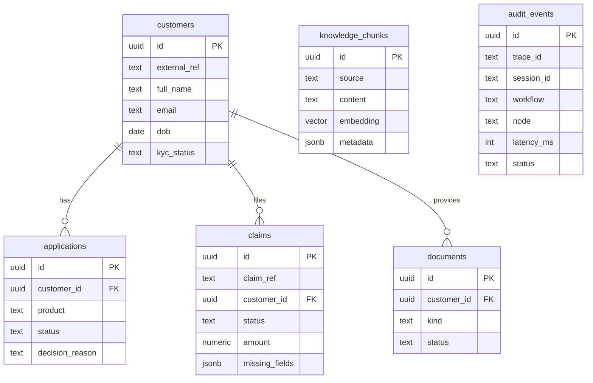

# AI Operations Control Tower — Implementation Plan

## Overview

Build a stateful AI operations orchestration platform: one conversational interface that
coordinates multiple business workflows, preserves context across workflow switches, exposes
task progress, and resumes reliably across user turns **and service restarts**.

Two source documents drive this plan:

- `Ajeya Take Home Assignment.pdf` — the requirements (authoritative)
- `AI_Operations_Control_Tower_Architecture_Reference.docx` — a prior HLD (a good starting
  point; this plan corrects two gaps in it, flagged below)

**The single most important constraint is not technical.** The assignment states that a
candidate who cannot explain any code, infrastructure, or design decision in the submission
may be **disqualified**. So this plan optimizes for *defensibility*, not just delivery:
fewer moving parts, explicit tradeoff documentation, and a build order that front-loads the
areas you flagged as weakest (AWS networking, Terraform, CI/CD) so you have days — not
hours — to understand them.

### Non-negotiable ground rule for this build

Every time you accept a generated file, you owe yourself a one-line answer to "why does this
exist and what breaks if I delete it?" If you can't answer, stop and work it out before
moving on. Budget ~90 minutes at the end of each day for this. It is the highest-value time
in the whole week, and it is the thing the interview actually tests.

---

## Requirements Traceability

The assignment is a checklist in disguise. Every requirement, and where it is satisfied:

| # | Assignment requirement | Where satisfied | Risk |
|---|---|---|---|
| 1 | LangGraph as **primary** orchestration framework | `backend/app/graph/` — main graph + 3 subgraphs | Low |
| 2 | State management | `ControlTowerState` + Postgres checkpointer | Low |
| 3 | Conditional routing | `add_conditional_edges` in every subgraph | Low |
| 4 | Multi-step workflows | Onboarding (6 nodes), Claims (5), Knowledge (5) | Low |
| 5 | Workflow transitions | Supervisor `Command(goto=...)` routing | Low |
| 6 | Multi-agent coordination | Planner + Supervisor + 3 workflow agents | Low |
| 7 | Error handling | `RetryPolicy`, `error_handler=`, terminal failure nodes | Medium |
| 8 | Context management | `add_messages` reducer + checkpoint resume | Low |
| 9 | Planning **before** execution | Planner node emits structured task DAG, surfaced in UI | Low |
| 10 | ≥3 operational workflows | Onboarding, Claims, Knowledge (RAG) | Low |
| 11 | Move between workflows mid-session | Supervisor re-plans; `workflow_states` keyed per workflow | Medium |
| 12 | Frontend: interaction, workflow visibility, task tracking | Chat + plan DAG + task timeline | Low |
| 13 | Backend: orchestration, state, execution, data access | FastAPI + LangGraph + SQLAlchemy | Low |
| 14 | Frontend/backend deployed **independently** | Separate ECR repos, ECS services, CI pipelines | Low |
| 15 | Runs on AWS | ECS Fargate + RDS + ALB | Medium |
| 16 | Terraform-provisioned | `terraform/` modules + dev environment | **High** |
| 17 | ECS | Fargate, 2 services | Medium |
| 18 | Docker | Multi-stage Dockerfiles both services | Low |
| 19 | CI/CD | GitHub Actions, OIDC → ECR → ECS | **High** |
| 20 | Networking design documented | `docs/networking.md` | Medium |
| 21 | **Additional challenge:** frontend↔backend private, via domain name, no direct IP | BFF proxy + Cloud Map private DNS (see ADR-001) | **High** |
| 22 | Docs: architecture, LangGraph, state, AWS, networking, Terraform, ECS, CI/CD, assumptions, tradeoffs, future work | `docs/` — 10 files | Medium |

Items 16, 19, 21 are both the highest-risk *and* your self-identified weak spots. The build
order below deliberately attacks them on Day 2, not Day 6.

---

## Two Corrections to the Prior HLD

The architecture reference doc is solid but has two gaps that will bite during implementation.

### Gap 1 — the Next.js private-DNS collision (the crux of the assignment)

The HLD says "frontend-to-backend communication uses a private DNS name such as
`backend.internal`." True for **server-side** Next.js code. But a chat UI is inherently
browser-side and streaming, and **a browser cannot resolve a private VPC domain**.

The obvious workaround — ALB path-routing `/api/*` straight to the backend — quietly defeats
the requirement: the backend becomes publicly reachable and the frontend never actually uses
the private domain. See **ADR-001** for the resolution.

### Gap 2 — `ChatBedrockConverse` has no native async

`langchain-aws`'s `ChatBedrockConverse` contains no `async def` at all. `ainvoke`/`astream`
work only via `BaseChatModel`'s default `run_in_executor` bridge around blocking boto3. A
worker thread is held for the **entire** model call, including the full duration of a
streamed response, and the default executor caps at `min(32, cpu_count + 4)` — so FastAPI
concurrency silently ceilings there and excess requests queue invisibly. See **ADR-004**.

---

## Architecture Decision Records

These are the decisions an interviewer will probe. Each states the alternatives and the
tradeoff, which the assignment explicitly asks for.

### ADR-001 — Frontend→backend private communication

There are actually **two** decisions here, and conflating them is the usual mistake:

- **A — browser traffic:** how does a *client component* reach the backend at all, given a
  browser cannot resolve a private VPC name?
- **B — service discovery:** what does `api.internal` resolve to for *server-side* callers?
  (ADR-001b.)

**Decision A: Next.js route handler as a BFF proxy; backend holds zero public ingress.**

```
Browser ──TLS──▶ Public ALB ──▶ Next.js (ECS)   ← the only public target
                                     │
                                     └──▶ http://api.internal.<domain>:8000 ──▶ FastAPI (ECS)
                                          (private DNS, resolved in-VPC)
```

| Option | Meets "private domain"? | Backend public? | Verdict |
|---|---|---|---|
| (a) Next.js BFF proxy | ✅ every hop | ❌ none | **Chosen** |
| (b) ALB path-routing `/api/*` → backend | ❌ | ✅ full HTTP surface | Rejected |
| (c) Internal ALB + private zone | — this is Decision B, not an alternative to (a) | | see ADR-001b |

**Why (b) is genuinely disqualifying, not just weaker.** Under path-routing, the frontend
never calls the backend at all — the *browser* does, over the public internet. No private
domain participates in the path, and `https://app../api/*` is reachable by any curl or
scanner. Private *subnets* are not private *communication*. This is almost certainly what
the exercise is probing: the naive `NEXT_PUBLIC_API_URL` answer silently requires a public
backend.

**A second, non-obvious win.** `NEXT_PUBLIC_*` vars are inlined by the bundler at
`next build`, not read at runtime. With the BFF, client components call `fetch('/bff/...')` —
a **relative** URL — so there is no public API URL to bake in, and one image promotes
unchanged from local to dev to prod. Same-origin also means no CORS and no `SameSite=None`.

> ⚠️ **Trap — do not use `next.config.js` `rewrites()` for this hop.** Rewrites are evaluated
> at build time and frozen into `routes-manifest.json`; `next start` never re-reads them. A
> `destination: process.env.BACKEND_INTERNAL_URL` reproduces the exact build-time problem you
> were escaping, somewhere nobody thinks to look. Rewrites also have a history of dropping
> `text/event-stream` bodies. **Use an explicit route handler.**

> ⚠️ **Namespace the proxy `/bff/*`, not `/api/*`.** If you ever add an ALB rule for `/api/*`
> it shadows your own App Router handlers. Cheap to get right on day one.

**Cost to accept honestly:** the frontend fleet now carries API throughput, not just
rendering, and you own the streaming-correctness problem in ADR-002.

### ADR-001b — Service discovery: internal ALB + Route 53 private hosted zone

**Decision: internal ALB fronted by a Route 53 private hosted zone. Reject ECS Service
Connect. Cloud Map is the runner-up.**

AWS's blanket 2026 recommendation is Service Connect. **Two reasons override it here:**

1. **Service Connect's default `perRequestTimeout` is 15 seconds, and an SSE stream never
   "completes."** Streams die at 15s with `ERR_SOCK_CLOSED` regardless of heartbeats. It's
   fixable (`per_request_timeout_seconds = 0`), but the injected Envoy sidecar's config is
   not editable and there are further reports of it buffering token streams.
2. **Service Connect isn't DNS.** AWS states plainly that it *"doesn't use or create DNS
   hosted zones in Amazon Route 53"* — names are resolved by the sidecar, only from inside
   SC-configured tasks. The assignment asks for a **private domain name**. An internal ALB +
   private hosted zone gives you a literal one.

**Why not Cloud Map** (free, real Route 53 records, and explicitly named in the assignment)?
It's a legitimate answer and worth one paragraph in `docs/networking.md` as the cheaper
alternative. But it resolves to **task IPs**, and undici (Node's fetch) caches DNS — so when
your crash-recovery demo replaces the backend task, the frontend can hold a stale IP. The
internal ALB gives a **stable** endpoint with health-checked targets, which the Day-7 demo
depends on. $20/mo (~$2 for a 3-day window) buys that reliability. Say exactly this in the
docs — cost-vs-reliability, decided deliberately, is the answer an interviewer wants.

```hcl
resource "aws_lb" "internal" {
  name               = "backend-internal"
  internal           = true
  load_balancer_type = "application"
  subnets            = module.vpc.private_subnets
  security_groups    = [aws_security_group.internal_alb.id]
  idle_timeout       = 300
}

resource "aws_lb_target_group" "backend" {
  target_type          = "ip"     # required for Fargate awsvpc
  port                 = 8000
  protocol             = "HTTP"
  vpc_id               = module.vpc.vpc_id
  deregistration_delay = 180      # your real in-flight budget — see ADR-005b
  health_check { path = "/health"  interval = 30  timeout = 10 }
}

resource "aws_route53_zone" "internal" {
  name = "internal.example.com"
  vpc { vpc_id = module.vpc.vpc_id }   # presence of vpc{} makes it private
}

resource "aws_route53_record" "backend" {
  zone_id = aws_route53_zone.internal.zone_id
  name    = "api"
  type    = "A"
  alias {
    name                   = aws_lb.internal.dns_name
    zone_id                = aws_lb.internal.zone_id
    evaluate_target_health = true
  }
}
```

### ADR-002 — SSE streaming through the BFF proxy

**Decision: stream over SSE; pass the upstream `ReadableStream` through untouched.**

Streaming *does* survive the hop — Next.js flushes per chunk with backpressure, and
**the ALB does not buffer response bodies for IP targets.** (The widespread "ALB buffers
SSE" claim comes from ALB→*Lambda*, a genuinely buffered path. Fargate targets stream fine.)
Every real failure here is self-inflicted:

```ts
// app/bff/chat/route.ts
export const dynamic = 'force-dynamic'   // never prerender or cache this route
// runtime defaults to 'nodejs' — required; Edge cannot reach a VPC-private host

export async function POST(req: Request) {
  const upstream = await fetch(`${process.env.BACKEND_INTERNAL_URL}/chat`, {
    method: 'POST',
    headers: {
      'Content-Type': 'application/json',
      Accept: 'text/event-stream',
      'Accept-Encoding': 'identity',   // stop undici decompressing → stale headers
    },
    body: JSON.stringify(await req.json()),
    cache: 'no-store',                 // bypass Next's patched-fetch tee/buffer
    signal: req.signal,                // propagate client disconnect upstream
  })

  if (!upstream.ok || !upstream.body) {
    return new Response(await upstream.text(), { status: upstream.status })
  }

  return new Response(upstream.body, {   // pass through — never await the stream
    status: 200,
    headers: {                            // ALLOWLIST. Never spread upstream.headers.
      'Content-Type': 'text/event-stream; charset=utf-8',
      'Cache-Control': 'no-cache, no-store, no-transform, must-revalidate',
      'X-Accel-Buffering': 'no',
    },
  })
}
```

**Failure modes, in the order they bite:**

1. **Spreading upstream headers.** Undici auto-requests gzip, decompresses the body, and
   leaves `content-encoding: gzip` *and the original `content-length`* on the headers object.
   Copy those onto a decoded stream and you get `ERR_CONTENT_DECODING_FAILED`, or a silent
   truncation with no server-side error. Allowlist headers; `Accept-Encoding: identity`
   removes the ambiguity at source.
2. **Next's own gzip.** `compress` defaults true and *does* compress `text/event-stream`;
   it survives only because of the per-chunk flush. `no-transform` is the documented escape
   hatch. **Never put nginx or Express compression in front of Next** — you lose the flush
   and it batches. Classic works-in-dev, breaks-in-prod.
3. **Next's patched `fetch`** takes a cache branch that tees or buffers the whole body.
   `cache: 'no-store'` + `force-dynamic`.
4. **Awaiting inside the handler.** `for await`-ing then returning buffers everything.

Verify with `curl -N -i`, never a browser. Pages Router `pages/api` does **not** stream —
App Router only.

**ALB settings that matter:**

| Setting | Value | Note |
|---|---|---|
| `idle_timeout` | **300** (default 60) | Reset by any byte either direction — heartbeats do protect it |
| `client_keep_alive` | 3600 (default) | **Hard wall-clock cap; does NOT reset.** The real ceiling on one stream |
| `enable_http2` | true | But HTTP/2 PING frames do **not** reset idle timeout — heartbeat at the body layer |
| `load_balancing_algorithm_type` | `round_robin` | **Not `least_outstanding_requests`** — open streams count as outstanding forever and starve tasks |

Backend: `EventSourceResponse(gen, ping=15)`. Set uvicorn `--timeout-keep-alive` **above**
the ALB idle timeout or you get 502s when the ALB reuses a just-closed connection.

⚠️ **Three hops must all not buffer**: ALB→Next, Next→internal ALB, internal ALB→backend.
Test the whole chain on Day 2, not the backend alone. Fallback if it proves unreliable: poll
`/tasks` for progress plus a non-streamed final response — less impressive, but it preserves
the private-DNS property, which matters more than token streaming.

### ADR-003 — Graph shape: explicit planner + supervisor, not a prebuilt agent

**Decision: hand-built `StateGraph` with a planner node, a supervisor node, and three
compiled subgraphs.**

`langgraph-supervisor` exists but its own README now steers people away
("we recommend using the supervisor pattern directly via tools"). More importantly, a
prebuilt agent hides exactly the machinery the assignment asks you to demonstrate —
conditional routing, state transitions, multi-agent coordination. Building it explicitly is
both more defensible and more visible in the code.

`create_react_agent` is deprecated in favour of `create_agent` — avoid both here.

### ADR-004 — LLM provider abstraction

**Decision: a thin provider interface; Anthropic API directly for local dev, Bedrock on ECS.**

Local dev uses `langchain-anthropic` (native async, no AWS gating, fast iteration). Production
uses Bedrock for the AWS-native story.

Because `ChatBedrockConverse` is not natively async (Gap 2), production must either raise the
default executor **and** boto3's `max_pool_connections` together, or use `langchain-aws`'s
Anthropic-SDK-backed Bedrock client, which is genuinely async (trade-off: fewer regions, no
Guardrails/Knowledge Bases). **Recommendation: raise both pools** — it keeps the standard
Bedrock surface and the fix is one lifespan hook plus one botocore `Config`, which is easy to
explain. Document the async caveat in `docs/tradeoffs.md`; it is a strong senior-level signal.

**Model IDs differ by client — a common trap:**

| Client | ID form |
|---|---|
| `ChatBedrockConverse` (bedrock-runtime Converse) | `us.anthropic.claude-opus-4-8` — geo inference-profile prefix **required** |
| Anthropic Bedrock (Mantle) client | `anthropic.claude-opus-4-8` — no geo prefix |
| Anthropic API direct (local dev) | `claude-opus-4-8` |

Pricing, per million tokens, for the cost model: **Opus 4.8** $5 / $25 · **Sonnet 5** $3 / $15
· **Haiku 4.5** $1 / $5.

> **Decision for you:** the plan assumes Opus 4.8 everywhere for quality. If demo cost
> matters, the planner and supervisor are cheap, high-frequency, structured-output calls —
> Sonnet 5 or Haiku 4.5 handle them well at a fraction of the price, while workflow
> reasoning stays on Opus. Make this call deliberately; it's a good thing to have an opinion
> about in the interview.

### ADR-005 — Postgres for everything (+ pgvector)

Domain tables, LangGraph checkpoints, and vector search all live in one RDS instance.

- **pgvector 0.8.2** on **PostgreSQL 17.11+ or 18.1+**. This is a *security* floor, not just
  features — it fixes **CVE-2026-3172**, a buffer overflow in parallel HNSW index builds.
- `CREATE EXTENSION vector;` — **no `shared_preload_libraries`, no reboot, no superuser.**
  It's a trusted extension. (The "needs a parameter group change" belief is wrong.) It goes
  in Alembic migration 0001; there's no Terraform resource for it.
- **Use HNSW, not IVFFlat.** The decisive reason isn't recall — it's lifecycle. IVFFlat
  trains on populated data, so centroids go stale as the corpus grows and recall *silently*
  degrades. HNSW builds on an empty table and accepts live inserts. Start `m=16,
  ef_construction=128`, runtime `hnsw.ef_search=100` (the default 40 is too low).
- ⚠️ **Set `hnsw.iterative_scan = relaxed_order` for any filtered query.** Without it, a
  `WHERE` matching 10% of rows with `ef_search=40` returns ~4 rows for a `LIMIT 10` — no
  error, just missing results. This is the most common "pgvector is broken" report.
- Use `vector_cosine_ops` / `<=>`. **The index opclass must match the query operator** or the
  planner silently seq-scans: correct results, terrible latency, tests still pass.
- **Under ~50K vectors, build no index at all** — exact search is 100% recall in single-digit
  ms. Your demo corpus is well under this. Build the HNSW index anyway *to demonstrate you
  can*, and note in the docs that it isn't load-bearing at this scale.

### ADR-005b — Postgres for everything

Domain tables, LangGraph checkpoints, and vector search (pgvector) all live in one RDS
instance. Explicitly out of scope for v1: Kubernetes, Kafka, Neo4j, MongoDB, a dedicated
vector DB, Step Functions. The defensible line: *"complexity is added when a requirement
justifies it, not to raise the technology count."*

---

## LangGraph Design

### Pinned versions

These matter — the LangGraph 1.x API differs substantially from 0.x, and two of these pins
are security floors.

```
langgraph==1.2.11
langgraph-checkpoint>=4.2.0,<5        # 4.2.0 is the floor for CVE-2026-48775
langgraph-checkpoint-postgres==3.1.2  # <3.1.1 has CVE-2026-71433
langchain==1.4.1
langchain-core>=1.6.3,<2
langchain-aws==1.7.8
langchain-anthropic                   # local dev provider
psycopg[binary,pool]>=3.2.0
```

⚠️ **Trap:** `langgraph-checkpoint-postgres` only requires `langgraph-checkpoint>=4.1.0`,
which resolves to a *vulnerable* version. Pin the floor explicitly.

API changes to be aware of (training data and most blog posts are stale):
`config_schema` → `context_schema`; `checkpoint_during` → `durability`;
`add_conditional_edges` no longer takes `then=`; `.stream()` takes `version=`;
`create_react_agent` → `create_agent`.

### `ControlTowerState`

TypedDict, not Pydantic — the docs state Pydantic state is less performant, and it's the
documented default.

```python
class ControlTowerState(TypedDict):
    messages: Annotated[list[AnyMessage], add_messages]
    session_id: str
    user_id: str
    trace_id: str
    customer_id: str | None
    current_intent: str | None
    plan: Annotated[list[PlanTask], merge_tasks]   # custom reducer — see below
    active_workflow: str | None
    workflow_states: dict[str, dict]
    tool_results: Annotated[list[ToolResult], operator.add]
    errors: Annotated[list[ErrorRecord], operator.add]
    pending_question: PendingQuestion | None
    final_response: str | None
    schema_version: int
```

**`merge_tasks` is the subtle bit.** Subgraphs update individual task statuses; a naive
last-write-wins reducer loses concurrent updates. Merge by task `id`, taking the newer
status. Be ready to explain why `operator.add` is wrong here — it's a good interview answer.

```python
class PlanTask(BaseModel):          # Pydantic here — this IS LLM structured output
    id: str
    workflow: Literal["onboarding", "claims", "knowledge"]
    action: str
    args: dict
    depends_on: list[str]
    status: TaskStatus              # PENDING|READY|RUNNING|BLOCKED|NEEDS_INPUT|DONE|FAILED
    attempts: int
    result_ref: str | None
    error: str | None
```

### Graph topology

```
START → planner → supervisor ─┬→ onboarding_subgraph ─┐
                              ├→ claims_subgraph      ├→ supervisor (loop)
                              ├→ knowledge_subgraph   ┘
                              └→ compose_response → END
```

- **Planner** — turns the user goal into a structured task DAG with `depends_on`. Uses
  `with_structured_output(Plan, include_raw=True)` so a malformed plan doesn't kill the run.
- **Supervisor** — selects the next task whose dependencies are all `DONE`, routes via
  `Command(goto=..., update=...)`. Annotate the return as
  `Command[Literal["onboarding", "claims", "knowledge", "compose_response"]]` so LangGraph
  can infer edges for visualization.
- **Subgraphs** — compiled and passed directly as nodes (shared state keys, so no wrapper
  needed). **Do not compile with `checkpointer=False`** — that silently disables interrupts
  inside them, which would break the pause/resume demo.

### Human-in-the-loop (the "request more information" pause)

Use the `interrupt()` function, not `interrupt_before` — the docs are blunt that static
interrupts are for debugging, not HITL.

⚠️ **The caveat that will bite you:** resuming **re-runs the node from the top**, not from
the `interrupt()` line. Any side effect before an `interrupt()` executes twice. Rule: put
`interrupt()` first in the node, or isolate side effects into their own node.

### Checkpointing

`AsyncPostgresSaver` over a connection pool, built inside the FastAPI lifespan (its
`__init__` calls `asyncio.get_running_loop()`, so module-level construction raises). Three
connection kwargs are mandatory and non-obvious — be ready to explain each:

| kwarg | Why |
|---|---|
| `autocommit=True` | Migrations use `CREATE INDEX CONCURRENTLY`, forbidden inside a transaction |
| `row_factory=dict_row` | The saver indexes rows by name; default gives `TypeError` |
| `prepare_threshold=0` | Disables prepared statements — mandatory behind PgBouncer/RDS Proxy |

⚠️ **`.setup()` has an undocumented concurrency hazard.** It has no advisory lock and isn't
transactional. If N ECS tasks boot simultaneously against a stale schema, losers crash on a
`UniqueViolation`, and concurrent `CREATE INDEX CONCURRENTLY` can leave an `INVALID` index.
**Run `setup()` as a single-process pre-deploy ECS task behind `pg_advisory_lock`**, never in
lifespan. This is a genuinely strong thing to have designed for.

Use `durability="async"` (the default). Never `"exit"` for interruptible workflows — a crash
mid-run loses everything.

### Streaming

`astream(..., stream_mode=["updates","messages","custom"], subgraphs=True, version="v2")`.
`version="v2"` gives a uniform `StreamPart` shape and removes all shape-sniffing.
`get_stream_writer()` emits per-node progress for the task timeline.

`astream_events(version="v3")` is nicer for interrupts but is flagged beta — a poor
foundation for a frontend contract. Stay on v2.

---

## The Three Workflows

### 1. Customer Onboarding — deterministic business logic + conditional routing

```
load_customer → validate_information → [missing?] → request_information (interrupt)
                                     → [complete] → verify_identity
                                            → [failed]  → manual_review
                                            → [passed]  → check_eligibility
                                                   → [eligible]   → create_application
                                                   → [ineligible] → reject
```

### 2. Claims Operations — tool/API-driven

```
retrieve_claims → [none] → return_not_found
                → [found] → validate_claim → [incomplete] → request_information (interrupt)
                                           → [complete]   → generate_summary
```

### 3. Knowledge Operations — RAG with citations

```
query_rewrite → embed → pgvector_retrieve → assemble_context → generate → answer + citations
```

Three distinct patterns on purpose: deterministic branching, external tool orchestration, and
retrieval-augmented generation. That variety is itself an argument.

---

## Data Model



Plus four LangGraph-managed tables (`checkpoints`, `checkpoint_blobs`, `checkpoint_writes`,
`checkpoint_migrations`) created by `.setup()`.

**Message history is context, not source of truth.** Workflow progress lives in `plan` and
the domain tables. Say this out loud in the interview — it's the distinction between a
chatbot and an orchestrator.

---

## Repository Structure

Refines the HLD skeleton. Additions marked `←`.

```
ai-operations-control-tower/
├── README.md
├── Makefile
├── docker-compose.yml
├── .env.example
├── docs/
│   ├── architecture.md      langgraph-design.md   state-management.md
│   ├── networking.md        ecs.md                terraform.md
│   ├── ci-cd.md             assumptions.md        tradeoffs.md
│   └── future-improvements.md
├── frontend/
│   ├── Dockerfile
│   ├── app/
│   │   ├── page.tsx
│   │   └── bff/[...path]/route.ts      ← BFF proxy — the ADR-001 mechanism
│   ├── components/  ChatPanel.tsx  WorkflowPanel.tsx  TaskTimeline.tsx
│   └── lib/
├── backend/
│   ├── Dockerfile
│   ├── pyproject.toml
│   ├── alembic/                        ← domain migrations (separate from checkpointer)
│   ├── app/
│   │   ├── main.py
│   │   ├── core/                       ← config, logging, tracing
│   │   ├── api/                        chat.py  sessions.py  tasks.py  health.py
│   │   ├── graph/
│   │   │   ├── state.py  planner.py  supervisor.py  routing.py
│   │   │   └── workflows/  onboarding/  claims/  knowledge/
│   │   ├── llm/                        ← provider abstraction (ADR-004)
│   │   ├── tools/  services/  db/  schemas/  prompts/
│   │   └── scripts/migrate.py          ← one-off ECS task: advisory lock + setup()
│   └── tests/  unit/  integration/  graph/
├── data/  seed/  knowledge/
├── terraform/
│   ├── bootstrap/                      ← state bucket (chicken-and-egg)
│   ├── modules/  networking/  ecs-cluster/  ecs-service/  alb/  ecr/
│   │             rds/  service-discovery/  secrets/  monitoring/
│   └── environments/dev/
└── .github/workflows/
    ├── backend-ci.yml   frontend-ci.yml
    ├── deploy-backend.yml  deploy-frontend.yml  terraform.yml
```

**Scope call:** build `environments/dev/` only. A `prod/` directory you never apply is
decoration; one clean environment plus a documented promotion path is more defensible.

---

## Infrastructure Specifics

The details here are the ones that cost hours if you discover them late. They map directly to
your three weak spots.

### Terraform

```hcl
terraform {
  required_version = ">= 1.11"        # write-only args landed in 1.11
  backend "s3" {
    bucket       = "bolttech-tfstate"
    key          = "app/dev/terraform.tfstate"
    region       = "us-east-1"
    encrypt      = true
    use_lockfile = true               # S3 native locking — NO DynamoDB table
  }
  required_providers {
    aws = { source = "hashicorp/aws", version = "~> 6.0" }
  }
}
```

**DynamoDB-based locking is deprecated** ("will be removed in a future minor version").
`use_lockfile` is current. Most tutorials still show the DynamoDB table — knowing why it's
gone is a cheap credibility win.

`environments/dev/` directories over workspaces: workspaces share one backend key and one
configuration, so environments can only differ by variable — exactly wrong when prod needs
Multi-AZ, deletion protection, and a different blast radius. Separate directories give
separate state, separate IAM, and a plan diff that can't target the wrong environment.

### ECS task definition

```hcl
deployment_circuit_breaker { enable = true  rollback = true }   # both required
health_check_grace_period_seconds = 60
wait_for_steady_state             = true
lifecycle { ignore_changes = [task_definition, desired_count] }  # CI owns the image
runtime_platform { cpu_architecture = "ARM64" }                  # ~20% cheaper
```

⚠️ **`stopTimeout` caps at 120 seconds on Fargate** (default 30). The common advice "set
`stopTimeout` ≥ drain time" is *impossible* beyond 2 minutes.

**But the ordering saves you:** ECS deregisters the target, waits out
`deregistration_delay` (up to 3600s), *then* sends SIGTERM, then waits `stopTimeout`. **Your
real in-flight budget is `deregistration_delay`, not `stopTimeout`** — set it ~180s. This is
a genuinely good thing to understand out loud.

**For LangGraph runs exceeding ~2 minutes, no shutdown tuning is sufficient.** That's the
architectural argument for the checkpointer: the task *will* die mid-run, so make steps
idempotent and let the client reconnect and resume. Your Day-7 demo is exactly this property.

Health checks: use **both** a container `healthCheck` and an ALB target-group check. Fargate
base images often lack `curl` — use `CMD-SHELL` with a `python -c "import urllib.request..."`
one-liner.

### Secrets — two different answers

| Secret | Approach | Why |
|---|---|---|
| LLM API key | Inject via task-def `secrets` + `valueFrom` | Doesn't auto-rotate; coupling to deploy is fine |
| DB credentials | `manage_master_user_password = true`, fetch at connect time | **Injected env vars are dead after 7 days** |

AWS: *"If the secret is subsequently updated or rotated, the container will not receive the
updated value automatically."* With RDS managed rotation (7-day cycle, no Lambda, password
never enters Terraform state), an injected DB password silently expires. The **execution**
role fetches secrets, not the task role — so the container never holds those credentials.
JSON-key selector syntax needs all positional colons: `...:password::`.

### DB migrations

Run as a **standalone `RunTask` before the service update** — not at app startup (N tasks
race the same migration) and not as an init container (runs on every scale-out). This is also
where `CREATE EXTENSION vector;` belongs, and where the LangGraph `.setup()` advisory-lock
wrapper lives.

### GitHub Actions → ECS

OIDC, no long-lived keys. **The thumbprint is no longer required** — omit `thumbprint_list`
entirely (AWS has validated GitHub's OIDC against its own CA library since 2023).

> 🔴 **Live gotcha that will hit you specifically.** GitHub is rolling out **immutable subject
> claims** embedding numeric IDs: `repo:octocat@123456/my-repo@456789:ref:...`. **Repos
> created after 2026-07-15 get the new format automatically** — and you're creating this repo
> today. A classic `repo:ORG/REPO:...` trust policy **will not match**. Inspect the actual
> claim before writing the policy, or you'll burn an afternoon on an opaque
> `AssumeRoleWithWebIdentity` denial.

Scope the trust policy to `repo:ORG/REPO:environment:dev` rather than a branch ref: the
`environment:` subject is only minted when the job declares `environment: dev`, which makes
required-reviewer approval a **hard precondition for the credential existing**, not just a UI
gate. Always pair with `aud = sts.amazonaws.com`.

**Tag images by git SHA and deploy by digest.** A task definition storing `:latest` cannot be
rolled back — revision N-1 re-resolves to whatever `latest` points at now. Set
`wait-max-delay-seconds: 15` or the SDK backs off to 600s and deploys appear to hang.

**Terraform/CI boundary:** Terraform owns everything with a lifecycle longer than one deploy;
CI owns exactly one mutable thing — which image digest runs. Hence `ignore_changes` on the
service, or Terraform reverts CI's image on the next apply.

---

## Build Order — One Week

The ordering principle: **walking skeleton first.** Get a trivial request flowing through
the entire pipeline — browser → ALB → Next.js → private DNS → FastAPI → RDS — and deployed
via CI **on Day 2**, while the app is still a stub. This front-loads your three weakest
areas and leaves five days to understand them, instead of discovering an IAM problem at
11pm on Day 6.

| Day | Goal | Done when |
|---|---|---|
| **0** (today) | Request Bedrock model access. Install `terraform`, `aws` CLI, `psql`. Create AWS account/budget alarm. `git init`. | `aws sts get-caller-identity` works; Bedrock access requested |
| **1** | Domain schema + seed data. `ControlTowerState` + reducers. Docker Compose up with Postgres+pgvector. One trivial 2-node graph checkpointing to Postgres. | Graph survives `docker kill` and resumes |
| **2** | **Walking skeleton on AWS.** VPC, public + internal ALB, ECR, 2 Fargate services, RDS, private hosted zone. Stub frontend calls stub backend over `api.internal.*` via the BFF. GitHub Actions OIDC deploy. **Verify SSE with `curl -N -i` across all three hops.** | A page load proves private DNS end-to-end, and a stream doesn't buffer |
| **3** | Claims + Onboarding subgraphs with deterministic tools. `interrupt()` pause/resume. | Pause → restart container → resume works |
| **4** | Planner + Supervisor. Multi-workflow single request. Workflow switching with context retained. | "Onboard X and check active claims" produces a correct task DAG |
| **5** | Knowledge/RAG with pgvector + citations. SSE streaming through the BFF proxy. Frontend: chat + plan DAG + task timeline. | Progress visibly streams per node |
| **6** | Error handling, retries, failure-path tests. Observability (`trace_id` through every layer). Migration-as-ECS-task. | Failure paths are tested, not just happy path |
| **7** | Documentation (10 files), architecture diagrams, README, demo recording. **Deploy, record, destroy.** | You can explain every file |

**If you fall behind, cut in this order:** (1) RAG reranking, (2) the prod Terraform
environment, (3) Redis, (4) the third workflow's depth — keep all three workflows but make
Knowledge shallower. **Never cut:** the private-DNS proof, checkpoint resume, or the docs.

---

## The Demo That Wins

Record a 3–5 minute screen capture. Three beats, in order:

1. **Planning before execution.** *"Onboard this customer and check whether they already
   have an active claim."* → the UI shows a task DAG with a dependency edge before any work
   starts. This directly answers the assignment's own worked example.
2. **Context across workflow switches.** Start onboarding → switch to a claim inquiry →
   return to onboarding. The customer context survives.
3. **Crash recovery — the senior-level proof.** Hit a `request_information` interrupt, then
   `docker kill` the backend (or force an ECS task replacement), bring it back, and resume
   from the checkpoint mid-workflow.

Beat 3 is what separates this from a chatbot with extra steps. It demonstrates state
management, stateless compute, and durable orchestration in a single unbroken take.

---

## Cost

Target: deploy → demo → **destroy**. List-price us-east-1 estimates:

| Component | ~$/month | ~$/day |
|---|---|---|
| Public ALB | 20 | 0.67 |
| Internal ALB (ADR-001b) | 20 | 0.67 |
| NAT Gateway ×1 | 33–40 | ~1.20 |
| Fargate 2×(0.5 vCPU/1GB), ARM64 | 29 | 0.97 |
| RDS db.t4g.micro single-AZ + 20GB gp3 | 14 | 0.47 |
| ECR + Secrets + CloudWatch | ~5 | 0.17 |
| **Total** | **~125** | **~4.15** |

A 3-day live window is roughly **$13**, plus Bedrock tokens. Controls: a billing alarm on
Day 0, and `terraform destroy` immediately after recording the demo.

**Two cost decisions worth stating in the docs as decisions, not omissions:**

- **Single NAT gateway, not one per AZ.** Production posture is one per AZ (~$66/mo) for
  resilience; traded deliberately for cost in dev.
- **One NAT beats VPC interface endpoints at this scale.** Endpoints are ~$7.30/mo each per
  AZ; you'd need `ecr.api`, `ecr.dkr`, `logs`, `secretsmanager` × 2 AZs ≈ **$58/mo** vs ~$33
  for one NAT. Endpoints only overtake NAT when *data processing* ($0.045/GB) dominates.

> ✅ **Do add the S3 gateway endpoint — it is free.** ECR image layers are served from S3, so
> it removes the single largest NAT data-processing line item. Highest-ROI row in the table.

ARM64/Graviton saves ~20% on compute; build natively on GitHub's arm64 runners, not QEMU.

---

## Risks

| Risk | Impact | Mitigation |
|---|---|---|
| **GitHub OIDC immutable subject claims** | Opaque `AssumeRoleWithWebIdentity` denial, hours lost | Repo created after 2026-07-15 → new claim format. **Inspect the actual claim before writing the trust policy** |
| Bedrock model access not granted in time | Blocks prod demo | Request Day 0; provider abstraction keeps dev unblocked on the Anthropic API |
| SSE buffers on one of three hops | Degrades the demo | Verify with `curl -N -i` on Day 2; fallback is polling `/tasks` |
| `.setup()` race on rolling deploy | Boot crash / INVALID index | One-off migration task behind `pg_advisory_lock` |
| `interrupt()` re-runs node from top | Duplicate side effects | `interrupt()` first in node, or isolate side effects |
| LangGraph run > 120s vs Fargate `stopTimeout` cap | Work killed mid-flight | `deregistration_delay=180` is the real budget; checkpoint + resume is the actual answer |
| Bedrock async bottleneck | Silent request queueing at ~32 concurrent | Raise executor **and** `max_pool_connections` together |
| Injected DB password expires after 7 days | Prod breaks days after deploy | `manage_master_user_password` + fetch at connect time |
| Terraform/IAM rabbit hole | Eats days | Walking skeleton on Day 2, not Day 6 |
| Python 3.13 wheel gaps | Lost hours | Pin **3.12** in the container |
| Over-scoping | Nothing finished well | Cut list above; three shallow workflows beat one deep one |

---

## Open Questions

1. ~~Cloud Map vs. Service Connect~~ — **resolved: internal ALB + Route 53 private zone** (ADR-001b).
2. **SSE through the full three-hop chain** — needs empirical verification on Day 2. Cannot be
   settled by research; the fallback is designed.
3. **Model tiering** — Opus everywhere, or Sonnet 5 / Haiku 4.5 for planner+supervisor? Your
   call (ADR-004). Planner and supervisor are high-frequency structured-output calls, so this
   is where the money goes.
4. **Single `dev` environment only?** — recommended; confirm you're comfortable defending it.
5. **AWS region** — must be one where your account has Bedrock model access.

### Unverified — check before relying on

- Exact current Terraform (~1.16) and `hashicorp/aws` (~6.65) patch versions. Confirmed:
  provider **v6** is the current major line, and its headline breaking change was
  provider-level region handling — read the v6 upgrade guide before pinning.
- `awslogs` vs `awsfirelens` — start with `awslogs` + `mode: non-blocking`; FireLens only if
  you need a non-CloudWatch sink.
- "ALB does not buffer for IP targets" is correct but has no single citable AWS sentence —
  it's inferred from gRPC/WebSocket streaming support. High confidence, weak citation.
- Service Connect Envoy *buffering* (distinct from the documented 15s timeout) rests on one
  field report. That uncertainty is itself part of why ADR-001b avoids it.

---

## Sources

- `Ajeya Take Home Assignment.pdf` — requirements (authoritative)
- `AI_Operations_Control_Tower_Architecture_Reference.docx` — prior HLD
- LangGraph 1.2.11 API research (versions, CVEs, checkpointer, interrupt, streaming)
- Anthropic model IDs and pricing — `claude-api` skill reference
- AWS/Terraform research — Next.js BFF/SSE behaviour, ECS Service Connect `perRequestTimeout`,
  S3 `use_lockfile`, Fargate `stopTimeout` cap, Secrets Manager rotation semantics, pgvector
  0.8.2 / CVE-2026-3172, GitHub OIDC immutable subject claims, cost modelling
